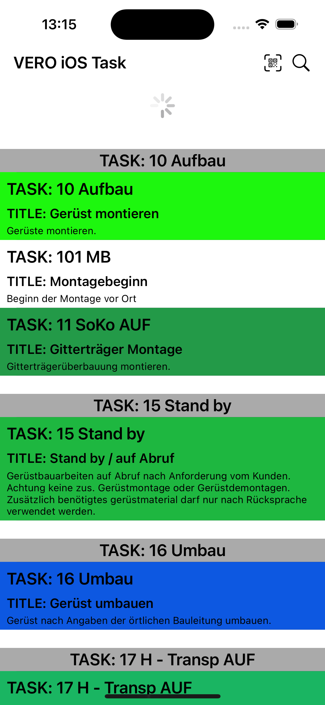
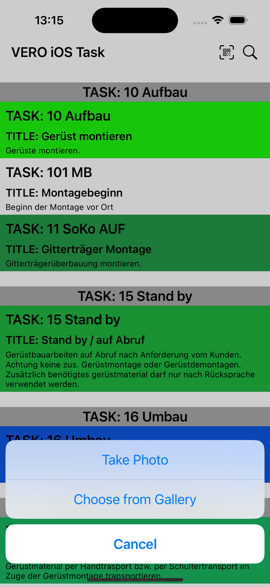
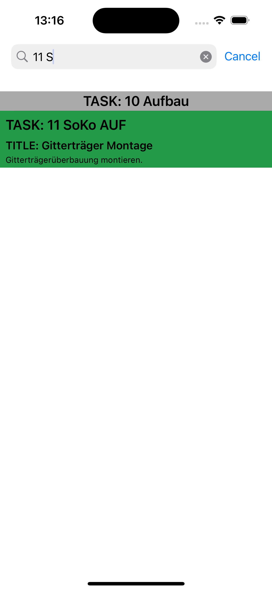

# VERO iOS Task

This iOS application is a task given to me as part of the hiring process. The task aims to evaluate the my coding skills in iOS development.

## Features

- Authentication
  - Token Handling
    - Parsed the access token from the response JSON object.
    - Stored the access token securely in the UserDefaults.
  - Token Expiry Handling
    - Implemented logic to handle token expiry and refresh if necessary.
    - Automatically refreshed the token when it expires to ensure uninterrupted access to the API.
- Remote API Integration
  - Connected to the remote API located at https://api.baubuddy.de/dev/index.php/v1/tasks/select
  - Fetched resources from the API.
- Offline Mode Support
  - Checked Wi-Fi status using NWPathMonitor
  - Implemented UserDefaults to store fetched resources
- List Display
  - Displayed fetched resources in a list format with grouped by items parent ID
  - Showed Task, Task Title and Task Description in a list with given color code
- QR Code Scanning
  - Integrated a QR Code Scanner using AVFoundation
  - You can scan QR using camera or gallery
- Search/Filtering
  - Implemented a search bar allowing users to search for tasks based on all of the properties on JSON with alphabetically
  - Automatically setted the search query to the scanned text upon successful QR code scan.
- Pull-2-Refresh
  - Implemented pull-to-refresh functionality to allow users to manually refresh the data from the remote API.

## Screens

<p align="center">
  
  
  
</p>

## Technologies Used

- MVVM Pattern
- UIKit
- UserDefaults
- AVFoundation
- Network
- NWPathMonitor
  
### Installation

1. Clone the repository.
```
  git clone https://github.com/Okariuss/VERO-ios-task.git
```
2. Open the project in Xcode.
3. Build and run the project in the Xcode simulator or on a physical device.

---

Happy coding! 🚀

